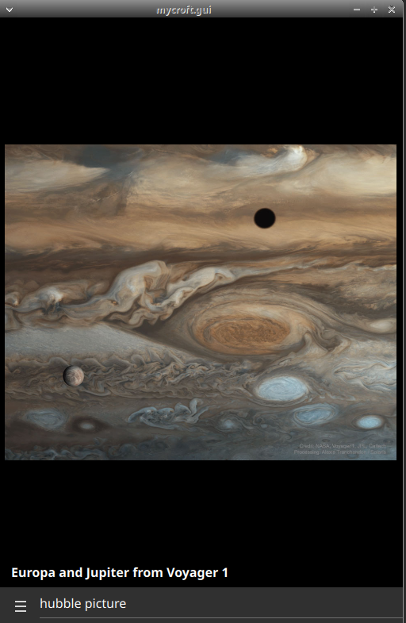
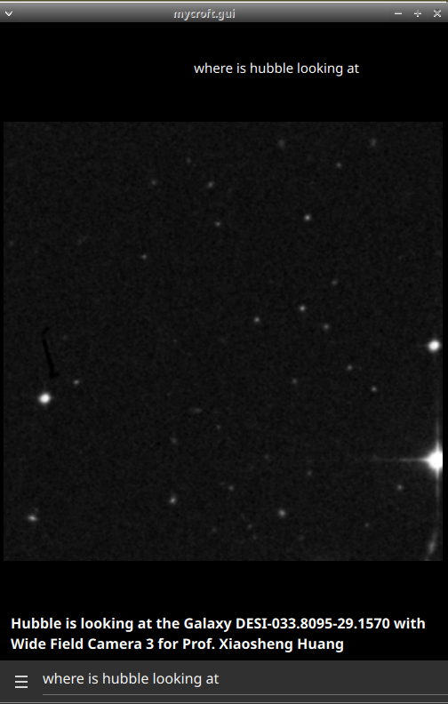
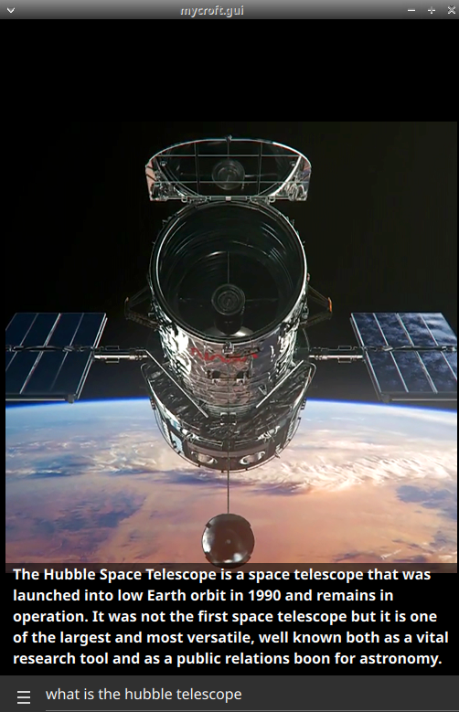
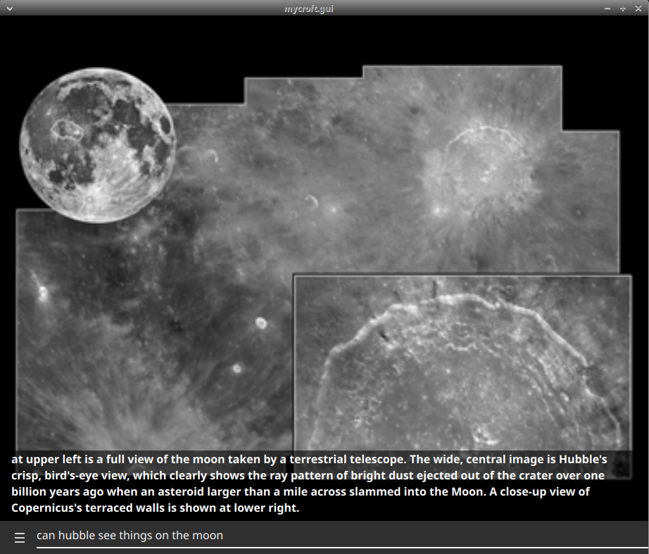
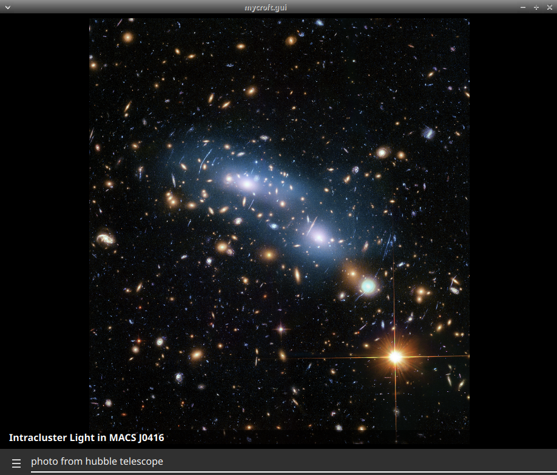
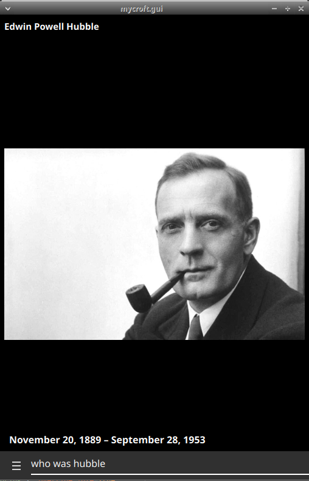
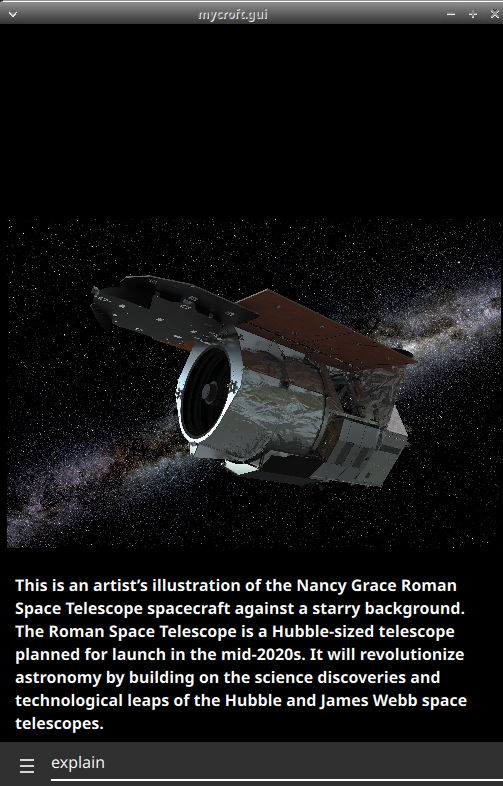

#  Hubble Space Telescope

## About

Pictures from [Hubble Space Telescope](https://hubblesite.org/)
  
Can be used as idle screen for the mark2

## Examples
* "picture from hubble site"
* "explain"
* "tell me about the hubble telescope"
* "who was hubble"
* "what is hubble space telescope mission" 
* "why was hubble created"
* "what are hubble's instruments"
* "how does hubble work"
* "did hubble find any planets"
* "can hubble take pictures of earth"
* "can hubble see things on the moon"
* "is hubble data public"
* "Can we see live photos from Hubble"
* "Where is the hubble telescope"
* "Where is hubble looking at"  -
* "Are the colors in hubble images real"

## Credits
- JarbasAi
- [Hubble Space Telescope](https://hubblesite.org/)

## Category
**Entertainment**

## Tags
#nasa
